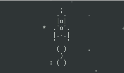

# async-space

This is a game about a spaceship traversing the cosmos that I created to practis asynchronous programming with Python.


### How to install

Python3 should be already installed.

### Launch

```
python3 main.py
```
Press arrow keys to control position of the spaceship.

### Project Goals

The code is written for educational purposes on online-course for web-developers [dvmn.org](https://dvmn.org/).
